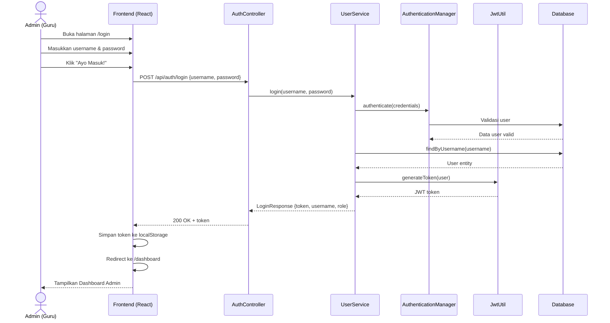
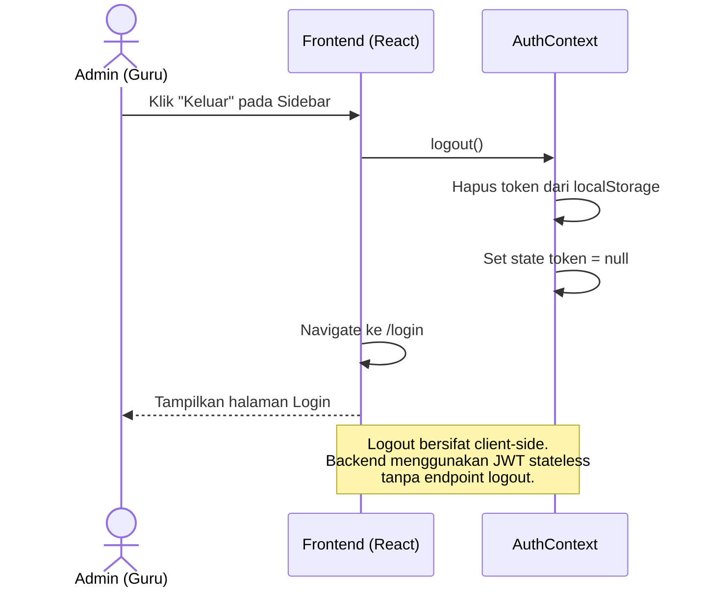
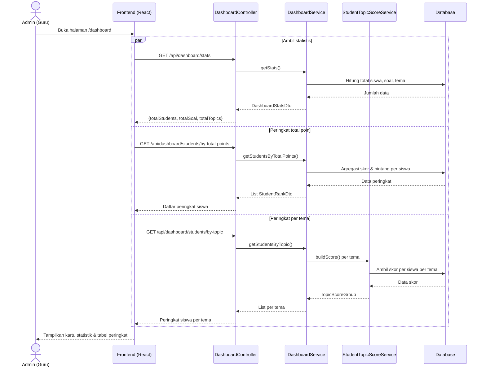
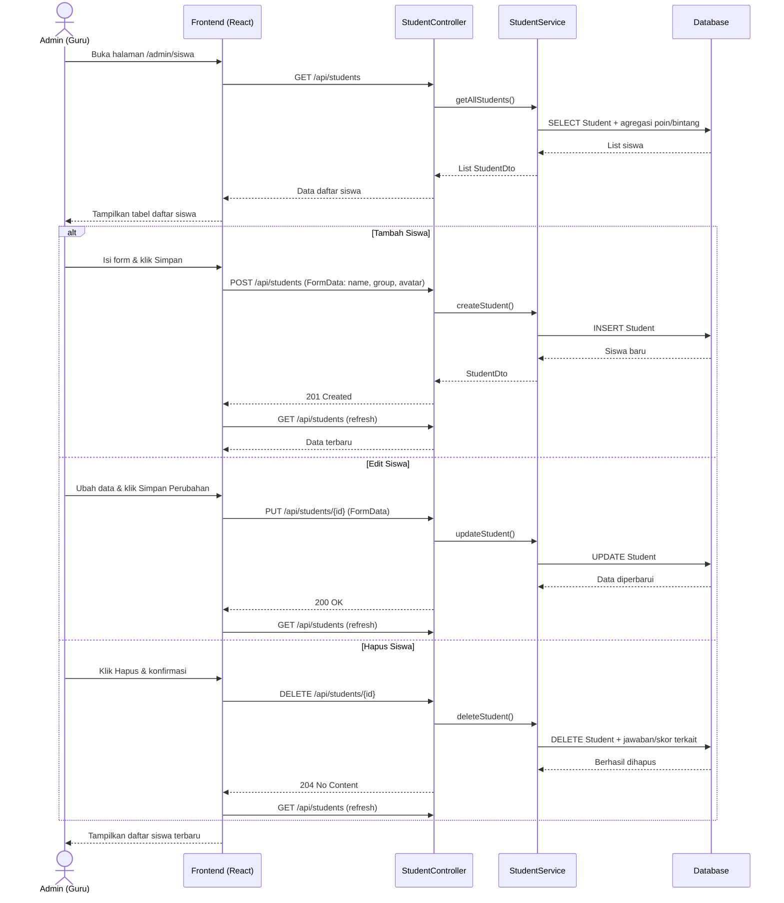
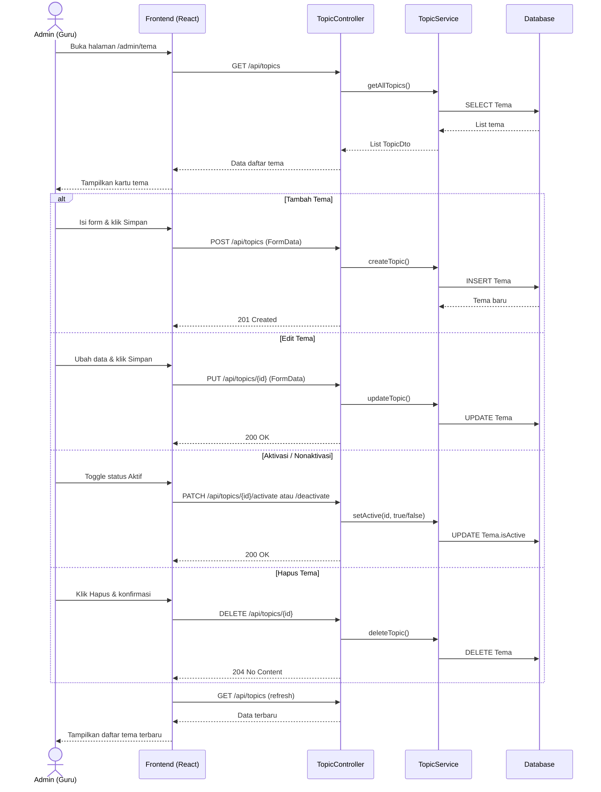
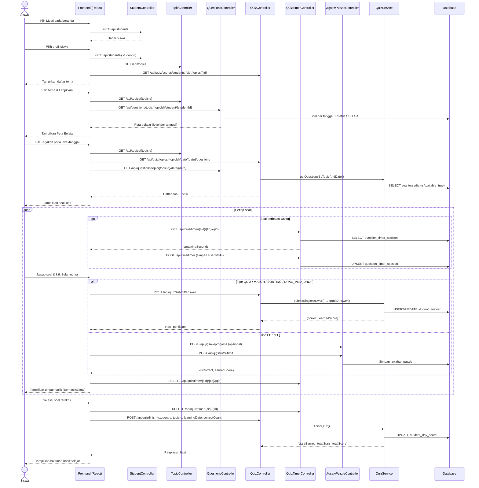
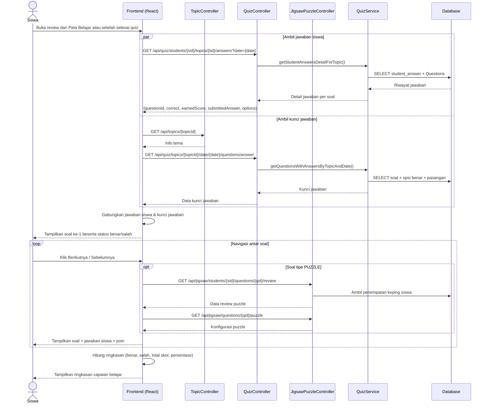

# Sequence Diagram — Sistem Gamifikasi Pembelajaran PAUD

Diagram berikut disusun berdasarkan implementasi **React Frontend** (`gamifikasiFE`) dan **Spring Boot Backend** (`gamifikasi`).

## File Draw.io

Buka di [draw.io](https://app.diagrams.net/) atau VS Code (extension Draw.io Integration):

| File | Proses |
|------|--------|
| `drawio/sequence/SD_01_Login_Admin.drawio` | Sequence Diagram Login Admin |
| `drawio/sequence/SD_02_Logout_Admin.drawio` | Sequence Diagram Logout Admin |
| `drawio/sequence/SD_03_Melihat_Dashboard.drawio` | Sequence Diagram Melihat Dashboard |
| `drawio/sequence/SD_04_Mengelola_Daftar_Siswa.drawio` | Sequence Diagram Mengelola Daftar Siswa |
| `drawio/sequence/SD_05_Mengelola_Daftar_Tema.drawio` | Sequence Diagram Mengelola Daftar Tema |
| `drawio/sequence/SD_06_Mengelola_Soal_Harian.drawio` | Sequence Diagram Mengelola Daftar Soal Harian |
| `drawio/sequence/SD_07_Memulai_Soal_Harian.drawio` | Sequence Diagram Memulai Soal Harian |
| `drawio/sequence/SD_08_Review_Hasil_Belajar.drawio` | Sequence Diagram Review Hasil Belajar |
| `drawio/sequence/SD_Gamifikasi_PAUD_All.drawio` | **Semua diagram (multi-page)** |

Regenerate: `python docs/generate_sequence_drawio.py`

---

## 3.2.1.1 Proses Bisnis Login Admin



---

## 3.2.1.2 Proses Bisnis Logout Admin



---

## 3.2.1.3 Proses Bisnis Melihat Dashboard



---

## 3.2.1.4 Proses Bisnis Mengelola Daftar Siswa



---

## 3.2.1.5 Proses Bisnis Mengelola Daftar Tema



---

## 3.2.1.6 Proses Bisnis Mengelola Daftar Soal Harian

```mermaid
sequenceDiagram
    actor Admin as Admin (Guru)
    participant FE as Frontend (React)
    participant Top as TopicController
    participant Q as QuestionsController
    participant Opt as QuestionOptionsController
    participant Match as MatchingRelationController
    participant Jig as JigsawPuzzleController
    participant QSvc as QuestionsService
    participant DB as Database

    Admin->>FE: Buka /admin/soal
    FE->>Top: GET /api/topics
    Top-->>FE: Daftar tema
    Admin->>FE: Pilih tema → Kelola Soal
    FE->>Top: GET /api/topics/{topicId}
    FE->>Q: GET /api/questions/topic/{topicId}
    FE->>Q: GET /api/questions/topic/{topicId}/learning-dates
    Q->>QSvc: getQuestionsByTopicId() + getAvailabilityByTopic()
    QSvc->>DB: SELECT Questions per tanggal
    DB-->>QSvc: Data soal & ketersediaan
    Q-->>FE: Kalender & daftar tanggal
    FE-->>Admin: Tampilkan kalender & soal per tanggal

    Admin->>FE: Pilih tanggal belajar
    FE->>Q: GET /api/questions/topic/{topicId}/date/{date}
    FE->>Q: GET /api/questions/topic/{topicId}/date/{date}/availability
    Q-->>FE: Daftar soal hari tersebut
    FE-->>Admin: Tampilkan daftar soal harian

    alt Tambah Soal
        Admin->>FE: Isi form Tambah Soal Baru
        FE->>Q: POST /api/questions (FormData)
        Q->>QSvc: createQuestion()
        QSvc->>DB: INSERT Questions
        Q-->>FE: Soal baru
        Admin->>FE: Kelola Opsi Soal
        FE->>Opt: POST /api/question-options (pilihan ganda/sorting)
        Opt->>DB: INSERT opsi_soal
        opt Tambah pasangan matching
            FE->>Match: POST /api/matching-relations
            Match->>DB: INSERT relasi_matching
        end
        opt Tambah puzzle
            FE->>Jig: POST /api/jigsaw/puzzles + pieces
            Jig->>DB: INSERT jigsaw_puzzle & jigsaw_piece
        end
    else Aktifkan Soal Harian
        Admin->>FE: Toggle ketersediaan tanggal
        FE->>Q: POST /api/questions/topic/{topicId}/set-available
        Q->>QSvc: setAvailabilityByTopicAndDate()
        QSvc->>DB: UPDATE Questions.isAvailable
        Q-->>FE: Status diperbarui
    else Duplikat / Ubah Tanggal
        Admin->>FE: Pilih duplikat atau ubah tanggal
        FE->>Q: GET soal tanggal sumber
        FE->>Q: POST /api/questions/{id}/duplicate atau PUT /api/questions/{id}
        Q->>QSvc: duplicateQuestion() / updateQuestion()
        QSvc->>DB: Salin/perbarui soal & relasi
        Q-->>FE: Berhasil
    else Hapus Soal
        Admin->>FE: Klik hapus soal
        FE->>Q: DELETE /api/questions/{id}
        Q->>QSvc: deleteQuestion()
        QSvc->>DB: DELETE Questions + opsi terkait
        Q-->>FE: 204 No Content
    end
    FE-->>Admin: Tampilkan daftar soal terbaru
```

---

## 3.2.1.7 Proses Bisnis Memulai Soal Harian



---

## 3.2.1.8 Proses Bisnis Review Hasil Belajar


